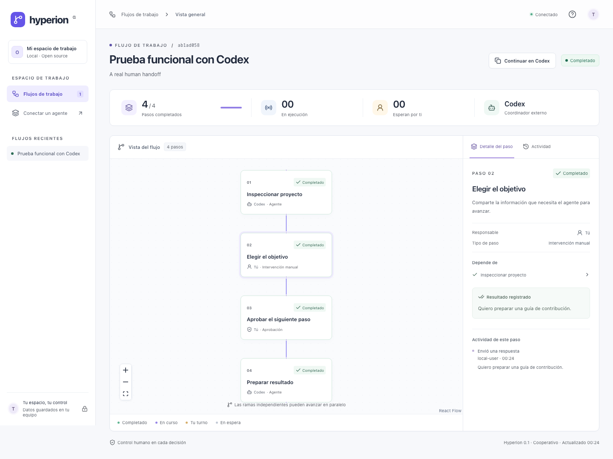

# Hyperion

**Human-guided workflows for any AI tool.** Turn a conversation into a visible plan: see what your agent is doing, supply information, review evidence, and decide when it can continue.

Hyperion is an independent, MIT-licensed module. It can accompany Codex or another compatible agent through HTTP, a CLI, or MCP. It has no dependency on Olimpo and does not require an AI API key.

> **v0.4 — local cooperative preview.** One trusted user and one external coordinator per execution. Hyperion manages workflow state; your agent performs the actual work. Multi-agent dispatch, hosted multi-user operation, and automatic conversation wakeups are future work.



## Start in your conversation

Say **“Usa Hyperion para [tu actividad]”** to a connected agent. It starts Hyperion, creates jobs and executable steps from the request, and shares the canvas. Choose between the job overview and detailed steps; focus or follow the active task. Human decisions show a concrete question, context and next action. Appearance and navigation preferences live in **Ajustes**. Switch vertical/horizontal from the direction button. SVG BPMN gateways, animated execution, waiting pulses, decision checklists and visible retries make the process readable.

For daily use, follow the [Spanish user manual](docs/manual-uso.md). The installation instructions below are for setting up a new environment; the user does not run them for each activity.

## Say “use Hyperion”

Install the portable skill once from a prepared checkout:

```sh
npm run hyperion -- install
```

Reload skills or open a new agent session, then ask: **“Use Hyperion to guide my next release.”** The agent starts the canvas on demand, generates a plan from your request, performs ready work and waits for your decisions in the canvas. Local agents with Agent Skills and shell access do not need MCP setup. MCP and HTTP remain available for other integrations.

For a standalone distribution, run `npm install --global ./hyperion-workflows-0.4.0.tgz`, then `hyperion install`. The archive includes the compiled server, UI and CLI. It is currently built locally with `npm pack`; this increment has not been published to npm or GitHub Releases. Node.js 22.13+ is required. [Installation, discovery and compatibility](docs/conexion.md).

## Desktop or split

The user can ask **“Usa Hyperion en split”** or **“Abre este flujo en escritorio”**. CLI and MCP preserve the same run in either presentation. Hyperion Desktop bundles its runtime; install/open it once, then use **Hyperion → Conectar con mi IA** to prepare the skill when needed.

DMG (macOS arm64/x64) and NSIS EXE (Windows x64) builds are configured in the repository. Local installers are development artifacts without release signing; Windows execution and public distribution remain unverified. See [Desktop build and validation](desktop/README.md). The manual GitHub workflow uploads build artifacts without publishing a release.

## Run from source

Requirements: Node.js **22.13+** (Node 24 LTS recommended) and npm. `node:sqlite` may emit an experimental warning on older supported Node versions.

```sh
npm ci
npm run build
npm start
```

Open **http://127.0.0.1:4317**. State and locally generated credentials live in `.hyperion/`, excluded from Git. The CLI and portable skill can also start the server on demand.

In another terminal, create a real workflow:

```sh
npm run hyperion -- create examples/codex-trial.json
```

Open the returned URL, submit your objective, and ask your agent to read the run and continue. The sample does not fabricate agent activity or run commands automatically.

## What works

- Directed acyclic plans with agent, manual, and approval steps.
- An executable BPMN-based profile: start/end and structured parallel, exclusive and inclusive gateways.
- Typed task inputs/outputs and public decision/action/observation traces, each available from node icons.
- Dependency gates, independent parallel steps, and explicit coordinator ownership.
- An edge-to-edge canvas with floating controls, task selection, focus and optional activity following. Manual navigation releases following; details, I/O and logs remain available in popups.
- Node popups for human input, approvals, step details and evidence; buttons for the original request and activity.
- Human input, approval/rejection, pause/resume, cancel, and retry after failure.
- Transactional SQLite persistence and command idempotency.
- Version checks that reject stale human decisions.
- A JSON HTTP API, CLI, and tested MCP stdio adapter.

The interface refreshes state every second. An agent must cooperate with the protocol; Hyperion cannot stop arbitrary work performed outside it. Plans are immutable in this release. Create a new run when the scope changes.

## Connect an agent

MCP is an optional alternative to the portable skill. After `npm ci`, configure your client with one command:

```sh
npm run hyperion -- setup codex  # or claude / cursor
```

The adapter starts Hyperion locally on demand. Reload MCP tools or start a new client session. No hand-written connection JSON is required. [Setup and manual alternatives](docs/conexion.md).

The CLI works immediately from an existing Codex conversation with local shell access:

```sh
npm run hyperion -- list
npm run hyperion -- get RUN_ID
npm run hyperion -- start RUN_ID STEP_ID
# Perform the actual authorized work using your own tools.
npm run hyperion -- complete RUN_ID STEP_ID 'What was done and how it was verified'
```

Start with a natural-language request: “Use Hyperion to guide me through…”. The connected agent generates the plan and records the request; users do not need to write JSON.

Run `npm run hyperion -- connect codex` (or `claude`, `cursor`, or your client ID) to generate its MCP connection configuration. Follow the [manual in Spanish](docs/manual-uso.md) for each application, a complete request-driven test case, and troubleshooting. See the [agent integration contract](docs/integration.md) for exact tools and the human handoff protocol.

## Develop and verify

```sh
npm run dev       # API, watch mode
npm run dev:ui    # Vite UI, separate terminal
npm run check     # Types, unit/integration/MCP tests, build, formatting
npx playwright install chromium
npm run test:e2e  # Real browser interaction and accessibility checks
```

Tests use isolated storage. The browser suite runs a separate server on port 4318 and resets only `.hyperion-e2e/`.

See [CONTRIBUTING.md](CONTRIBUTING.md), [SECURITY.md](SECURITY.md), and [CODE_OF_CONDUCT.md](CODE_OF_CONDUCT.md). CI runs on Node 22 and 24.

## Architecture

```text
src/domain/       Pure workflow model, validation, state transitions
src/server/       HTTP boundary, local sessions, transactional SQLite store
src/adapters/     HTTP client, CLI, MCP stdio server
src/client/       React UI and graph
```

[Architecture context and ArchiMate view](docs/architecture/README.md) · [First increment decision](docs/decisions/0001-functional-increment.md) · [Request-driven integrations](docs/decisions/0002-request-driven-integrations.md) · [Protocol](docs/protocol.md) · [Process and data contract](docs/process-contract.md) · [Functional test with Codex](docs/functional-test.md)

## Configuration

| Variable            | Default                           | Purpose                                                   |
| ------------------- | --------------------------------- | --------------------------------------------------------- |
| `HYPERION_PORT`     | `4317`                            | Local server port                                         |
| `HYPERION_DATA_DIR` | `.hyperion`                       | SQLite and credentials directory                          |
| `HYPERION_AGENT_ID` | `codex`                           | Registered CLI/MCP identity; also initial server identity |
| `HYPERION_URL`      | `http://127.0.0.1:4317`           | CLI/MCP target                                            |
| `HYPERION_TOKEN`    | Agent token from credentials file | Optional CLI/MCP credential override                      |

Use `127.0.0.1` in browser URLs, not `localhost`; Host and Origin are checked against the bound address. The local edition deliberately binds only to loopback. Do not expose it through a public tunnel or reverse proxy without adding a suitable authentication and authorization design.

## License

[MIT](LICENSE) — Copyright © 2026 Oscar Lobaton Salas.
