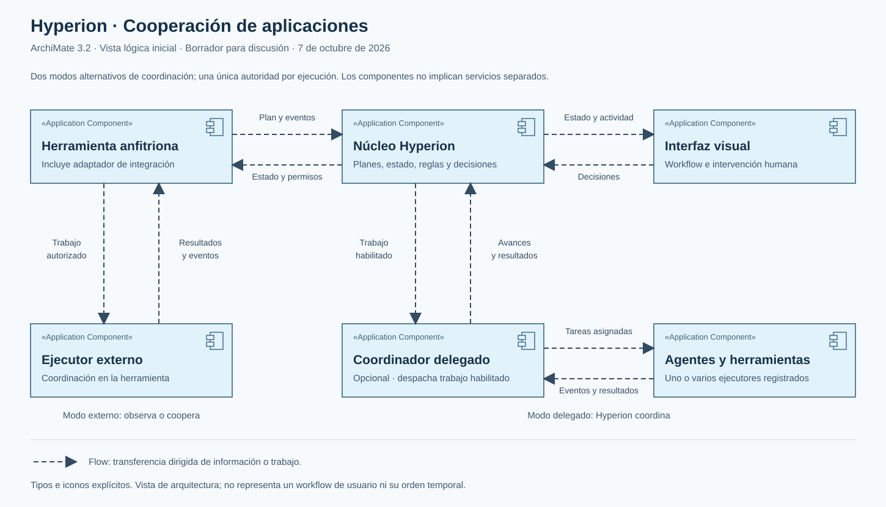
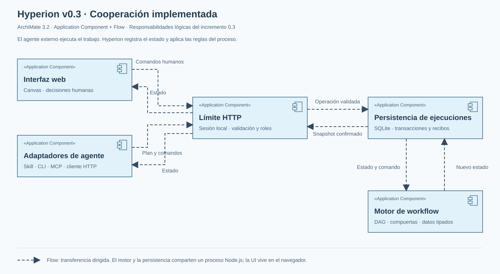

# Hyperion — contexto y propuesta de arquitectura

Estado: arquitectura de referencia y evolución del primer incremento. Propuesta original: 2026-10-07, America/Lima.

El usuario autorizó posteriormente iniciar la implementación en el repositorio y probarla con Codex. El [ADR 0001](../decisions/0001-functional-increment.md) concreta ese incremento; el [protocolo v0.1](../protocol.md) describe su comportamiento implementado.
Nombre del producto: Hyperion. Nombre actual del repositorio: `hiperion`.

## Requisitos confirmados por el usuario

Hyperion será un módulo independiente, acoplable a distintas herramientas. Olimpo es un consumidor posible, sin una posición especial en el núcleo. El usuario debe poder pedir desde su herramienta de IA que utilice Hyperion y obtener una vista interactiva del trabajo.

La experiencia principal muestra un proceso como un workflow: pasos, acciones internas, dependencias, responsables, progreso, actividad y resultados. Debe permitir trabajo manual, automático y colaborativo; aprobaciones y continuación paso a paso; y visibilidad de acciones concurrentes. El objetivo es hacer observable y dirigible el trabajo real. Se muestran planes, acciones, explicaciones públicas y evidencias, sin presuponer acceso al razonamiento interno de un LLM.

La propuesta inicial dejó abiertos el stack y el mecanismo de invocación. Tras la autorización de ejecución, el primer incremento eligió una web local con TypeScript, React, SQLite y adaptadores CLI/HTTP/MCP. La arquitectura distribuida y el despliegue remoto siguen abiertos. El desarrollo sigue TDD. La arquitectura se expresará con ArchiMate. La orquestación multiagente es una posibilidad solicitada para explorar, no un requisito de implementar varios agentes desde el primer incremento.

Las menciones a Covenant V2 y Olimpo son referencias contextuales del usuario. No se han inspeccionado sus diseños ni se presupone herencia técnica de ellos.

## Perspectiva empresarial

Propuesta de valor: convertir una intención en trabajo verificable, con participación humana y visibilidad transversal aunque cambie la herramienta que ejecuta.

| Participante                        | Necesidad                                   | Capacidad de Hyperion                                |
| ----------------------------------- | ------------------------------------------- | ---------------------------------------------------- |
| Persona que solicita el trabajo     | Comprender avance y decidir intervenciones  | Supervisión visual y control de pasos                |
| Persona que realiza tareas manuales | Saber qué entregar y cuándo                 | Instrucciones, dependencias y registro de evidencias |
| Responsable del proceso             | Rastrear decisiones, fallos y resultados    | Historial por ejecución y versión de plan            |
| Herramienta integradora             | Incorporar la experiencia sin reconstruirla | Contrato de integración independiente del proveedor  |

Capacidades propuestas: representar planes, gestionar ejecuciones, coordinar participación humana, integrar ejecutores, visualizar concurrencia y mantener trazabilidad. La asignación automática a agentes es una capacidad opcional adicional.

## Propuesta de límites y coordinación

Hyperion ofrece un núcleo común y una interfaz visual. Los adaptadores traducen las capacidades de cada herramienta al contrato de Hyperion. La compatibilidad será comprobable por operaciones soportadas; agnosticismo no significa control universal automático.

Se proponen tres niveles de integración:

1. **Observación:** la herramienta publica planes y eventos. Hyperion muestra lo recibido. No puede garantizar detener acciones externas.
2. **Coordinación cooperativa:** la herramienta consulta y respeta las autorizaciones y dependencias de Hyperion antes de ejecutar. Una tarea manual o aprobación pendiente mantiene el paso bloqueado.
3. **Ejecución delegada:** un coordinador de Hyperion distribuye tareas a ejecutores registrados y recoge sus resultados. Puede operar con uno o varios agentes.

Por cada ejecución se declara una única autoridad de coordinación: externa o delegada. Los subflujos pueden delegarse con un alcance explícito. No se permiten dos coordinadores que despachen por separado el mismo paso. El núcleo conserva el estado registrado en Hyperion; un registro reportado por un ejecutor no equivale por sí solo a verificar el efecto en el mundo externo.

Un agente planificador puede proponer pasos, cambios de plan y asignaciones. El motor de coordinación aplica reglas deterministas para dependencias, permisos y transiciones. La propuesta del LLM no sustituye las reglas de ejecución.

Una aprobación autoriza un alcance y una versión del paso. Una modificación material exige reevaluar esa autorización. Reintentos y reconexiones necesitan identidades estables y deduplicación; no se promete ejecución exactamente una vez de efectos externos.

## Vista de cooperación de aplicaciones

La vista inicial usa un subconjunto de **ArchiMate 3.2**, declarado para evitar mezclar versiones. Es una base de trabajo provisional, no una afirmación de que 3.2 sea la edición más reciente. La selección de versión y herramienta de modelado queda pendiente. The Open Group ya ha publicado ArchiMate 4.

Los seis elementos son `Application Component`. Las relaciones representadas son `Flow`, con dirección y contenido indicado. Los componentes son responsabilidades lógicas: el dibujo no obliga a desplegar seis servicios. Las etiquetas de modo son anotaciones, no elementos del metamodelo. La vista no representa el flujo de un usuario concreto ni impone que los dos modos de coordinación estén activos simultáneamente.

| ID  | Componente                         | Responsabilidad                                                                |
| --- | ---------------------------------- | ------------------------------------------------------------------------------ |
| A1  | Herramienta anfitriona y adaptador | Traducir la solicitud y publicar actividad desde la herramienta elegida        |
| A2  | Núcleo Hyperion                    | Registrar planes y ejecuciones; aplicar reglas y aprobaciones según modo       |
| A3  | Interfaz visual                    | Presentar el workflow y recoger las decisiones humanas                         |
| A4  | Ejecutor externo                   | Realizar acciones bajo la coordinación de la herramienta anfitriona            |
| A5  | Coordinador delegado               | Despachar trabajo autorizado cuando Hyperion recibe esa responsabilidad        |
| A6  | Agentes y herramientas             | Ejecutar unidades de trabajo mediante adaptadores; admite múltiples instancias |

La interfaz web local se utiliza en el primer incremento para compartir el mismo estado entre el agente y la persona. El acceso a archivos y procesos locales podría requerir un ejecutor local. El despliegue, la autenticación, el aislamiento entre usuarios y el canal de eventos se decidirán después de conocer esos requisitos.

## Ejemplo de uso propuesto

1. La persona pide en una herramienta compatible: «Usa Hyperion para guiar esta actividad».
2. La integración crea una ejecución, propone un plan y obtiene una referencia a su vista visual.
3. Hyperion muestra responsables, dependencias y puntos de intervención humana.
4. El coordinador autorizado despacha los pasos habilitados. Los independientes pueden avanzar en paralelo.
5. Los ejecutores publican acciones observables, resultados y solicitudes de intervención.
6. La persona aprueba, entrega un resultado manual o solicita cambios desde la vista.
7. El coordinador recibe o consulta la decisión y continúa según las capacidades de la integración.

No se presupone que una conversación suspendida pueda despertarse automáticamente. Cada adaptador deberá declarar cómo recibe decisiones, reanuda trabajo o necesita una nueva invocación humana. El primer incremento ofrece API HTTP, CLI y MCP stdio. Las decisiones se consultan mediante lecturas y esperas acotadas.

## Información que el modelo debe conservar

- **Definición del proceso y versión:** intención, estructura, responsables y condiciones de aceptación.
- **Ejecución:** instancia concreta y autoridad de coordinación.
- **Paso e intento:** unidad de trabajo y cada intento de realizarla; los reintentos no borran historia.
- **Dependencia:** condición que habilita trabajo posterior; el paralelismo se expresa mediante pasos independientes.
- **Ejecutor y capacidades:** qué puede hacer cada persona, agente o herramienta.
- **Aprobación o intervención:** solicitante, alcance, versión, decisión y evidencia.
- **Evento y artefacto:** actividad observable y resultado asociado a una ejecución y un paso.

La conversación aporta intención y aclaraciones, pero el estado de ejecución debe estar representado explícitamente. Los cambios de plan deben conservar su relación con el trabajo ya ejecutado.

## Escenarios de aceptación para el futuro TDD

Estos escenarios definen la arquitectura objetivo. El primer incremento tiene tests automatizados para coordinación cooperativa, permisos humanos, paralelismo, DAG, historial, persistencia y adaptadores. La modalidad de observación, las modificaciones de planes y la sustitución de ejecutores independientes quedan pendientes; los planes de v0.1 son inmutables.

| Escenario                                                     | Resultado esperado                                                            |
| ------------------------------------------------------------- | ----------------------------------------------------------------------------- |
| Una herramienta registra un plan de tres pasos                | La vista muestra el mismo orden, dependencias y responsables                  |
| Un paso requiere aprobación en modo cooperativo o delegado    | El ejecutor no recibe autorización hasta que la decisión válida existe        |
| La integración solo informa actividad                         | La vista declara su capacidad de observación y no ofrece garantías de bloqueo |
| Dos pasos independientes tienen ejecutores disponibles        | Pueden estar activos a la vez y ambos aparecen en el gráfico                  |
| Una tarea manual espera un archivo o dato                     | El sucesor permanece bloqueado hasta validar el resultado exigido             |
| Dos coordinadores intentan despachar el mismo paso            | Solo la autoridad declarada puede autorizarlo                                 |
| Se repite un evento tras una reconexión                       | No se duplica la transición ni se pierde el historial                         |
| Un ejecutor falla y se reintenta                              | Se registra otro intento y se preservan el fallo y sus evidencias             |
| Cambia materialmente un paso ya aprobado                      | La autorización anterior no habilita el nuevo alcance                         |
| Un agente propone un plan con dependencias cíclicas           | Se rechaza antes de activar la ejecución en la primera versión propuesta      |
| Una integración no puede reanudar una conversación            | Se indica la intervención necesaria para continuar                            |
| Un adaptador se sustituye por otro con las mismas capacidades | El modelo del proceso y sus estados conservan su significado                  |

Antes de cada incremento: escoger escenario, escribir el test que falla, implementar lo mínimo, refactorizar y verificar. Los contratos de adaptadores se probarán además de las reglas del núcleo.

## Decisiones pendientes y recorrido de arquitectura

Primero acordar el caso de uso inicial y el grado mínimo de control. Después modelar las vistas necesarias, manteniendo trazabilidad desde necesidades hasta pruebas:

1. Motivación y capacidades: interesados, objetivos, principios y requisitos.
2. Negocio: responsabilidades humanas, servicio ofrecido y ciclo de trabajo.
3. Aplicación: servicios, interfaces, componentes y contratos de integración.
4. Información: planes versionados, ejecuciones, autorizaciones, eventos y evidencias.
5. Tecnología: despliegue web/desktop/local/híbrido, almacenamiento y comunicaciones.
6. Implementación y migración: incrementos y criterios de aceptación antes de elegir y desarrollar el stack.

También quedan abiertos: herramienta del primer adaptador, necesidad de ejecución local, uso individual o multiusuario, alojamiento propio o compartido, permisos, retención de actividad y comportamiento ante pausa/cancelación de tareas ya iniciadas. No se ha decidido usar GitHub como motor; hoy es el repositorio del proyecto.

## Registro de acuerdos y propuestas

| ID  | Estado                    | Enunciado                                                                       |
| --- | ------------------------- | ------------------------------------------------------------------------------- |
| R01 | Confirmado por el usuario | Independencia de Olimpo y de herramientas de IA concretas                       |
| R02 | Confirmado por el usuario | Vista interactiva de pasos, acciones, participación humana y concurrencia       |
| R03 | Confirmado por el usuario | Conversación y arquitectura antes de implementar; TDD para el desarrollo        |
| R04 | Confirmado por el usuario | Usar ArchiMate y conservar contexto del proceso de diseño                       |
| P01 | Propuesto                 | Núcleo común, adaptadores y vista visual desacoplados                           |
| P02 | Propuesto                 | Niveles de observación, coordinación cooperativa y ejecución delegada           |
| P03 | Propuesto                 | Una autoridad de coordinación por ejecución y reglas deterministas              |
| P04 | Propuesto                 | Orquestación multiagente opcional, incluyendo delegación explícita de subflujos |
| P05 | Provisional               | Subconjunto ArchiMate 3.2 para la primera vista                                 |

## Referencias y validación

- [The Open Group — ArchiMate 101](https://archimate-community.pages.opengroup.org/workgroups/archimate-101/): separación entre estructura, comportamiento y relaciones; composición de vistas y leyendas.
- [The Open Group — publicación de ArchiMate 4](https://www.opengroup.org.cn/node/12886): referencia para revisar la versión definitiva del modelado.
- [Criterios previos de este entregable](criterios.md).

La validación documental y visual se registra en `validacion.md`. La arquitectura completa sigue en elaboración con el usuario.

## Correspondencia con el código actual

La vista `cooperacion.svg` conserva la arquitectura de referencia, incluyendo el coordinador delegado opcional. La vista `implemented.svg` representa únicamente las responsabilidades implementadas en v0.1, con elementos Application Component y relaciones Flow de ArchiMate 3.2. No expresa servicios desplegados por separado.

| Responsabilidad               | Implementación           | Estado                                       |
| ----------------------------- | ------------------------ | -------------------------------------------- |
| Adaptadores CLI y MCP         | `src/adapters/`          | Implementado; cliente HTTP compartido        |
| Interfaz visual               | `src/client/`            | Implementado; refresco cada segundo          |
| Límite HTTP y roles           | `src/server/app.ts`      | Implementado; loopback y sesión humana local |
| Persistencia transaccional    | `src/server/store.ts`    | Implementado; SQLite y recibos idempotentes  |
| Motor de estados              | `src/domain/workflow.ts` | Implementado; transiciones puras y DAG       |
| Coordinador delegado autónomo | Ninguno                  | Extensión pendiente                          |

La participación humana se representa en el producto mediante pasos manuales y de aprobación. El agente que usa CLI/MCP conserva la responsabilidad de ejecutar acciones externas. El [ADR 0002](../decisions/0002-request-driven-integrations.md) añade la petición original, la vista vertical y un registro de identidades de integración con credenciales propias. Los clientes comparten el núcleo y almacenamiento; cada ejecución conserva un coordinador.

El [ADR 0003](../decisions/0003-canvas-interaction.md) concentra la interacción en un canvas landscape y popups por nodo, sin añadir componentes ni cambiar las relaciones de la vista ArchiMate implementada.

El [modelo XML editable](implemented.xml) contiene los cinco componentes y ocho relaciones de la vista implementada. Se verificaron el XML y sus referencias; la importación y validación XSD en una herramienta ArchiMate quedan pendientes.
